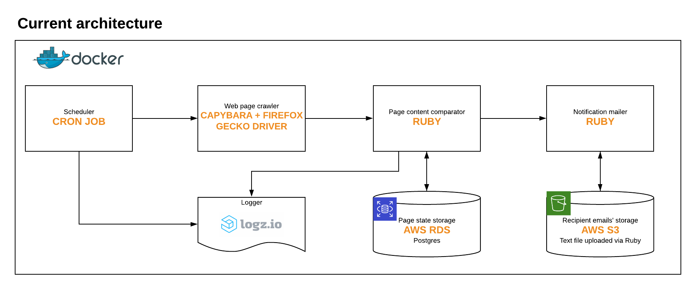

This project checks for changes on the OINP updates page.

This is the configuration for the cron job in the digital ocean droplet:

`40 * * * * cd /root/oinp_updates_checker && docker run oinp_updates_checker`

### Architecture

